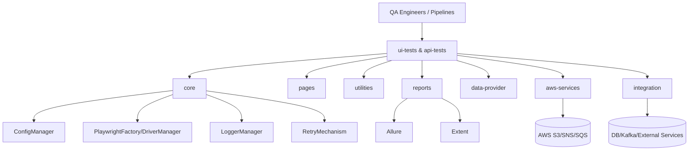
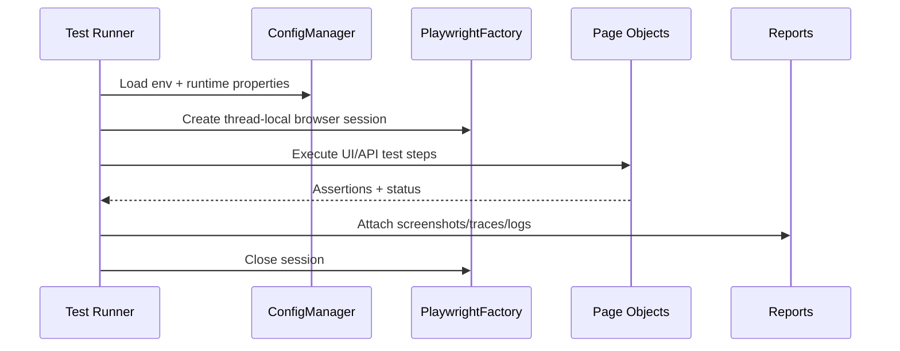

# Aegis Playwright Automation Framework

Enterprise-grade, multi-module Java 21 automation framework built with Gradle, Playwright, Cucumber, JUnit 5, Rest Assured, and AWS SDK v2.

## High-Level Architecture



## Low-Level Module Diagram

```mermaid
flowchart LR
    subgraph core
      FC[FrameworkConstants]
      CM[ConfigManager]
      LM[LoggerManager]
      PM[PlaywrightFactory]
      DM[DriverManager]
      RT[RetryMechanism]
      BT[BaseTest]
    end

    subgraph pages
      BP[BasePage]
      PF[PageObjectFactory]
      TAP[TestAutomationPracticePage]
      LP[LoginPage]
      HC[HeaderComponent]
    end

    subgraph utilities
      JU[JsonUtils]
      YU[YamlUtils]
      CU[CsvUtils]
      EU[ExcelUtils]
      DU[DateUtils]
      RU[RandomDataUtils]
      EN[EncryptionUtils]
      AU[ApiUtils]
      SU[ScreenshotUtils]
      BU[BrowserUtils]
      WU[WaitUtils]
      REU[ReportUtils]
    end

    subgraph aws-services
      AC[AwsConfig]
      ACM[AwsCredentialManager]
      S3[S3Helper]
      SNS[SNSHelper]
      SQS[SQSHelper]
    end

    subgraph api-tests
      ARB[ApiRequestBuilder]
      ARV[ApiResponseValidator]
      ATR[ApiTestRunner]
      SAT[SampleApiTest]
    end

    subgraph ui-tests
      SC[ScenarioContext]
      TH[TestHooks]
      LS[LoginSteps]
      UIR[UiTestRunner]
      UTS[TestAutomationPracticeScenariosTest]
    end

    subgraph reports
      ERM[ExtentReportManager]
      ALM[AllureReportManager]
      CRM[CustomReportManager]
    end

    subgraph data-provider
      DL[DataLoader]
      JDL[JsonDataLoader]
      YDL[YamlDataLoader]
      CDL[CsvDataLoader]
      EDL[ExcelDataLoader]
      TDF[TestDataFactory]
    end

    subgraph integration
      DBU[DatabaseUtils]
      KF[KafkaUtils]
      ESV[ExternalServiceClient]
      AIF[AwsIntegrationFacade]
    end

    ui-tests --> core
    ui-tests --> pages
    ui-tests --> reports
    ui-tests --> utilities
    api-tests --> core
    api-tests --> utilities
    pages --> core
    pages --> utilities
    aws-services --> core
    aws-services --> utilities
    integration --> aws-services
    integration --> core
    integration --> utilities
    reports --> core
    reports --> utilities
    data-provider --> core
    data-provider --> utilities
```



## Multi-Module Layout

```text
aegis-playwright-automation-framework
├── core
├── pages
├── utilities
├── aws-services
├── api-tests
├── ui-tests
├── data-provider
├── reports
└── integration
```

## Execution Flow



## Configuration

Environment-aware properties are under `core/src/main/resources`:
- `application.properties`
- `application-qa.properties`
- `application-uat.properties`
- `application-prod.properties`

Select environment:

```bash
./gradlew test -Denv=qa
```

## Browser Modes

Headless (default):

```bash
./gradlew :ui-tests:test
```

Headed:

```bash
./gradlew :ui-tests:test -Dheadless=false
```

Headed + visible slow motion:

```bash
./gradlew :ui-tests:test -Dheadless=false -DslowMoMs=700 --rerun-tasks
```

## Hybrid UI + API Scenario

`ui-tests` includes a Cucumber scenario that exercises UI and API calls in the same flow (`features/login.feature`):
- UI steps drive the demo login page.
- API steps start a local `/health` endpoint and validate the response in the same scenario context.

Run hybrid scenario:

```bash
./gradlew :ui-tests:test --tests com.enterprise.framework.ui.runner.UiTestRunner
```

## AWS Credential Precedence

`AwsCredentialManager` resolves credentials in this order:
1. AWS Profile (`aws.profile`)
2. Environment variables
3. Assume Role (`aws.roleArn`)
4. Default credential chain

## Reporting and Artifacts

- **Allure** attachments for screenshots/page source/traces on failures
- **Extent** HTML reports
- Execution logs per run in module build directories

## CI/CD

GitHub Actions workflow: `.github/workflows/ci.yml`
- Build
- Test execution
- Report artifact upload

## Notes

- Root legacy `src/` directory has been removed.
- Framework is structured for parallel/thread-safe browser execution with centralized config and logging.
